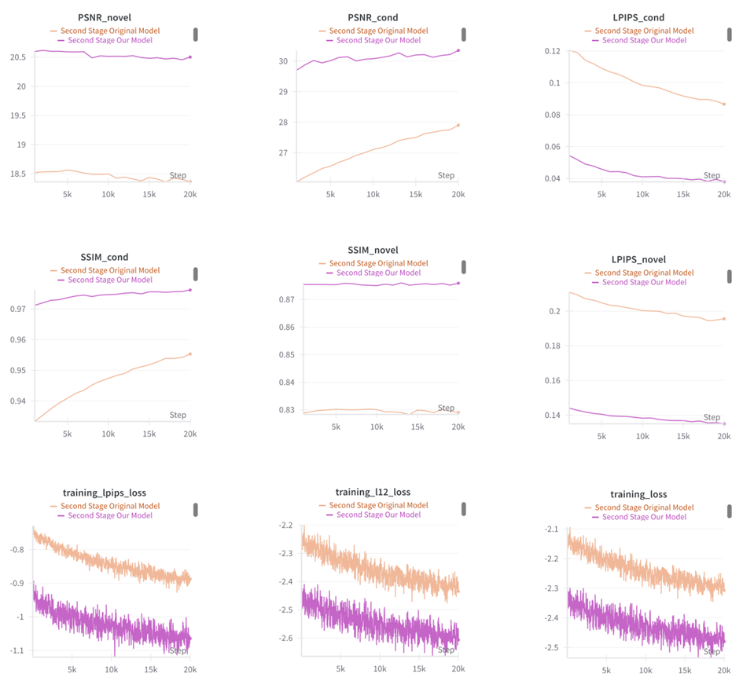
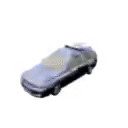
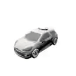
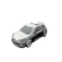

# Computer Vision Project Report

> **Installation:** Installation guidance provided in the original repository and remains the same.

## Task
To reduce the training complexity of the splatter-model, enhancing its ability to generalize effectively with less data.

## Explanation
We applied a method to decrease training time, resulting in a less complex training process. This reduction in complexity aims to support the generalization of the model, enabling it to perform well with a smaller dataset.

## Methodology

### Data Preparation
We utilized a pretrained splatter-image model to extract depth maps from each image in the dataset. These depth maps served as ground truth labels for training. Our hypothesis was that using depth maps in this way would yield promising results while consuming fewer computational resources.

> **Note:** If we had access to a dataset with depth maps extracted under more controlled or optimal conditions, the results would likely have been even better.

### Data Re-arrangement
In this step, we ensured that each depth map was properly aligned with its corresponding RGB input image, enabling accurate training inputs.

### Training Process
Due to hardware limitations, we focused on training the model to learn only the geometric structure of **cars**, using a reduced amount of data. To optimize the training process, we adjusted both the training procedure and the model inputs. 

  
   
  <em>Architecture diagram showing the training process with RGB input and depth map</em>

Specifically, during training, we fed the model the depth map of each image along with the corresponding RGB image. By using the depth map as ground truth for (x, y, z) reconstruction, the model was able to achieve more accurate geometric structure reconstruction of the 3D model without needing to predict it from scratch. This approach resulted in a faster understanding of the data, leading to a more efficient training process.

In parallel, we also trained the original network on the same data but without the depth map for comparison purposes. This allowed us to evaluate the impact of including depth maps on the model's performance and efficiency.

## Results

  
   
  <em>Stage one results: Performance metrics comparing our model (purple) with the original model (orange) across different evaluation metrics</em>

  
   
  <em>Stage two results: Performance metrics comparing our model (purple) with the original model (orange) across different evaluation metrics</em>

### Analysis
As we can see, our model consistently outperforms the original in all the key areas we measured. The results show clear improvements in image quality, with higher PSNR values, especially when generating images based on specific conditions. The lower LPIPS scores indicate that the images our model generates are perceptually closer to the actual ground truth, and the higher SSIM scores suggest that our model preserves structural details more effectively. 

It's worth noting that in the PSNR_cond graph, we observe slightly lower values for our model in the second stage. This is actually an expected outcome, as our model is constrained by depth map information, forcing it to emphasize and account for the 3D structure of objects. While this might result in slightly lower PSNR values, it ultimately leads to more structurally accurate and realistic 3D-aware representations. 

The training loss graph shows that our model trains more efficiently and stays more stable, keeping loss values lower throughout. These combined improvements across various metrics suggest that our model is significantly better at both conditional and novel image generation compared to the original baseline.

### Key Capabilities

1. **Conditional Image Generation:** The model generates images based on given inputs or conditions (e.g., labels, partial images), producing outputs that match the specific input requirements.

2. **Novel Image Generation:** The model creates new, unseen images without explicit conditioning, demonstrating its ability to generate high-quality, diverse images independently of input data.

## Reconstruction Results

  
  
  
   
  <em>Figure 2: Multiple views of reconstructed car models demonstrating consistent quality across different perspectives</em>

  
  
  
   
  <em>Figure 2: Multiple views of reconstructed car models demonstrating consistent quality across different perspectives</em>

